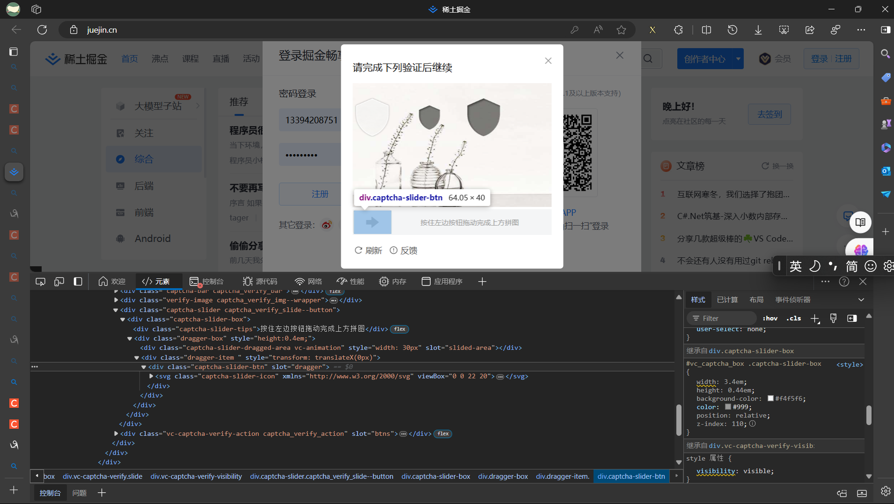
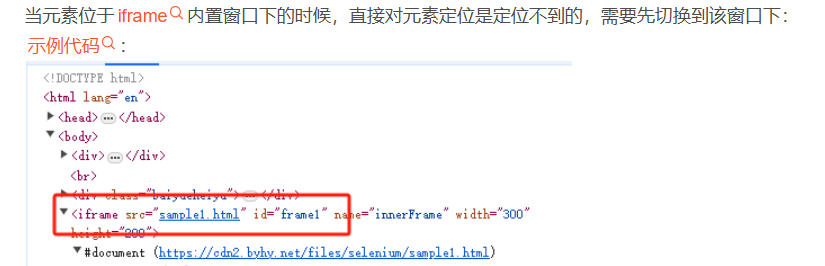

# 2152505 实验报告

## 实验背景和目的

爬取掘金特定主题文章并进行多类分析

## 技术栈

- **js逆向技术**：用于绕过网站的前端加密和反爬虫机制。
- **xpath分析**：用于解析网页，快速定位和提取网页中的数据。
- **Playwright技术**：自动化测试工具，用于模拟浏览器行为，实现自动化爬取网页数据。
- **OpenCV技术**：用于处理可能遇到的图像验证码。
- **ddddocr技术**：一个OCR库，用于识别和处理图像中的文字信息。


## 实验过程
### 1. 环境准备

- 安装Node.js、Python和相关库（Playwright、OpenCV、ddddocr等）。
### 2. 网站分析

- 使用浏览器的开发者工具分析掘金网站的结构和反爬机制。
- 确定需要使用js逆向的地方，以及可以应用xpath进行数据提取的结构。
- 分析掘金网站结构，登录窗口的滑块验证方式




```python
# 获取frame
from playwright.sync_api import sync_playwright
p=sync_playwright().start()
browser=p.chromium.launch(headless=False)
page=browser.new_page()
page.goto("https://cdn2.byhy.net/files/selenium/sample2.html")
frame = page.frame_locator("iframe[src='sample1.html']")

# 再 在其内部进行定位
lcs = frame.locator('.animal').all()
```

### 3. 数据爬取

- 对遇到的图像验证码，使用OpenCV和ddddocr技术进行处理和识别。编写爬虫代码，通过playwright库模拟浏览器行为，获取滑块验证码图片，并调用第三方库识别滑块验证码


- 当然，您也可以使用登录之后将cookies保留，进行登录使用，我们提供了这种方式。您只需要第一次进行登
录，然后就可以免登录进行内容爬取和分析，如果给您试图构建一个完全自动化的工具，本文提供的openc精度可能并不足以支持完全自动化，因此建议您改进CVPassconfirm文件中的验证码识别之后再进行构建。我们使用了两种方式进行识别，opencv templatematch的精度大约能到每七次，正确一次，ddddocr大约五次中可以正确一次。

- 使用Playwright模拟用户登录、浏览特定话题的文章。
- 应用xpath分析技术提取文章标题、作者、发布时间和内容等信息。


### 4. 数据处理和情感分析

- 对爬取到的文章内容进行预处理，包括去除HTML标签、特殊字符等。
- 获取到的URLS在控制台输出：

- 使用情感分析库或模型对文章内容进行情感倾向性判断。

## 实验结果

- 成功爬取了掘金网站上特定话题下的100篇文章。
- 通过情感分析，发现大部分文章呈现积极正面的情绪，少部分文章中性或略带负面情绪。


