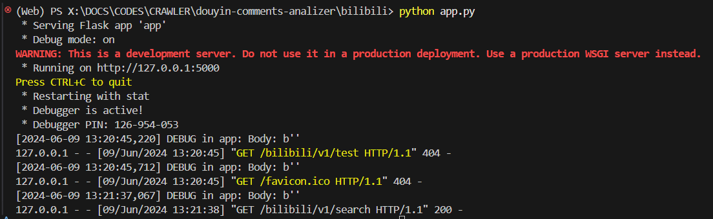
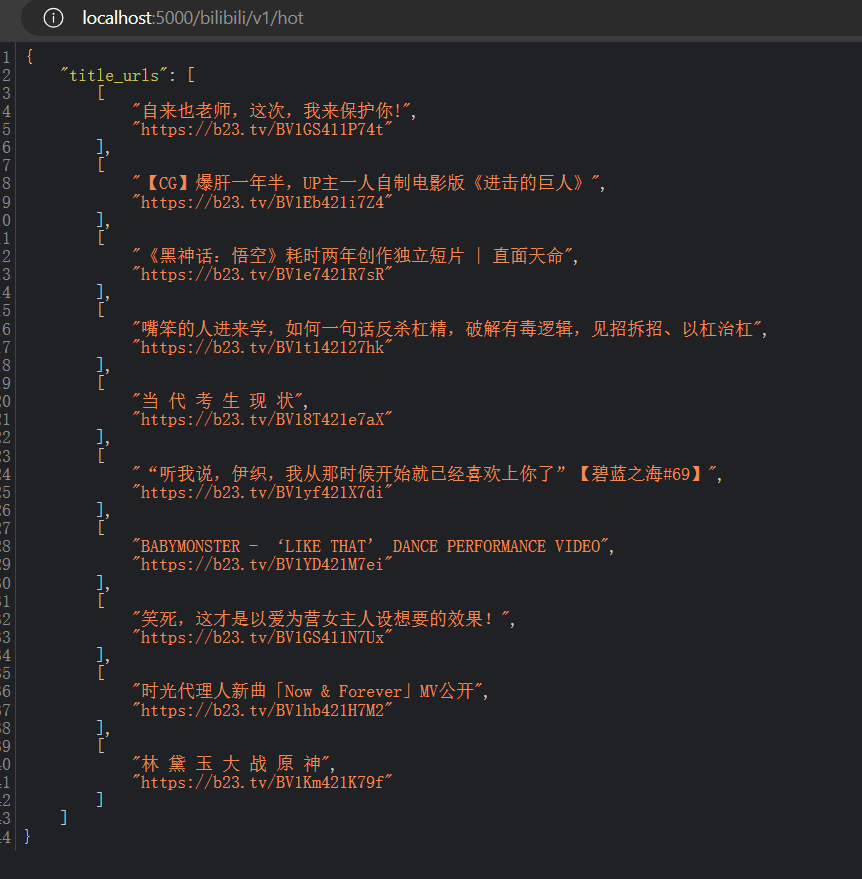
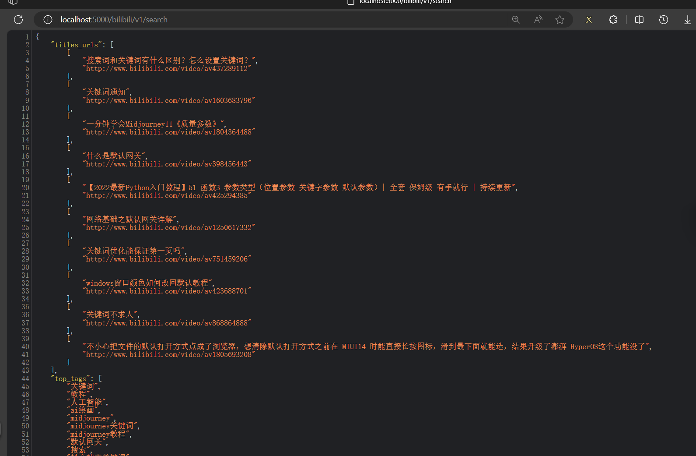

# juejin-bilibli-comments-analizer
本文实现了两种方式爬取网页数据
- 第一种是手动实现浏览器模拟进行网页自动化登录然后分析网页进行信息爬取，最后结合分析工具和UI设计形成一个可执行程序。

- 第二种方式是通过bilibili api爬取网页数据，使用flask作为框架，搭建应用平台，可以有效监控数据返回情况，同时可以更加高效地进行数据的爬取分析，实现一个app雏形。
- 本文作者2152505 栾学禹

- **注意：本实验代码均为个人实现，该代码仓库为私有仓库，仅供大数据作业使用，未经本人同意，禁止使用搬运**
# 2152505 实验报告

## 实验背景和目的

### 掘金
掘金是一个专注于技术的网站，用户可以在上面分享和讨论技术相关的文章、教程、问答等内容。为了更好地了解用户对掘金网站的体验和偏好，我们编写了一个爬虫程序，用于爬取掘金网站上特定主题的文章，并进行多类分析。

爬取掘金特定主题文章并进行多类分析从本质上来讲并无特殊新意，但通过爬取和分析，我们可以了解用户对掘金网站的体验和偏好，进而改进网站的设计和功能。同时网上关于playwright过反扒二维码机制的文章并不多，本实验尝试使用opencv和ddddocr库进行过关，并尝试使用playwright进行自动化爬取，以期获得更好的爬取效果。

同时我们使用词云技术对爬取到的文章内容进行可视化处理，以展示文章内容的整体结构和分布情况。

最后使用tkinter进行UI设计，以实现一个完整的爬虫程序。

### bilibili网站

bilibili是一个视频分享网站，用户可以在上面分享和观看各种类型的视频内容。为了更好地了解用户对bilibili网站的体验和偏好，我们编写了一个爬虫程序，用于爬取bilibili网站上特定主题的视频标题以获得最新的视频导向。

然后通过flask框架包装成一个app雏形，通过blueprint模块化设计不同功能：
- search：定向搜索指定主题的内容
- chart：随机视频截取
- hot：热点视频截取
- subtitle：次级标题获取

通过以上功能，我们可以了解用户对bilibili网站的体验和偏好，进而改进网站的设计和功能。


## 技术栈

- **Flask框架**：本地app调试，更高效的处理爬取的信息，通过包装成一个app雏形，可以更加方便地调试爬取代码
  
- **bilibili API**：调用api进行数据爬取对比，bilibili api应该不是bilibili官方实现的api，同时也不具备自动通过验证码过滑块等验证技术，因此本文对于掘金的爬取可以相互弥补，或可以成为一个改进的方案
  
- **Blueprint技术**：用于将不同的功能模块化，提高代码复用性和可维护性。绑定指定功能到对应的网址之上。  
- **js逆向技术**：用于绕过网站的前端加密和反爬虫机制。
- **xpath分析**：用于解析网页，快速定位和提取网页中的数据。  
- **Playwright技术**：自动化测试工具，用于模拟浏览器行为，实现自动化爬取网页数据。  
- **OpenCV技术**：用于处理可能遇到的图像验证码。  
- **ddddocr技术**：一个OCR库，用于识别和处理图像中的文字信息。  
- **Tkinter UI界面**：使用Tkinter为基础进行UI界面设计，同时提供了Tkinter+Figma设计的可能性，在resources文件夹中提供了build文件夹下提供了Figma文件，您可以通过Figma进行UI界面设计。  
- **WordCloud词云技术**：用于对爬取到的文章内容进行可视化处理，以展示文章内容的整体结构和分布情况。  
- **情感分析技术**：用于对爬取到的文章内容进行情感倾向性判断。  
- **词频分析技术**：用于对爬取到的文章内容进行词频统计，以展示文章内容的整体结构和分布情况。

## 实验过程
### 一、playwright框架实现自动化工具爬取分析
#### 1.1. 环境准备

- 安装Node.js、Python和相关库（Playwright、OpenCV、ddddocr等）。
#### 1.2. 网站分析

- 使用浏览器的开发者工具分析掘金网站的结构和反爬机制。
- 确定需要使用js逆向的地方，以及可以应用xpath进行数据提取的结构。
- 分析掘金网站结构，登录窗口的滑块验证方式


```python
# 获取frame
from playwright.sync_api import sync_playwright
p=sync_playwright().start()
browser=p.chromium.launch(headless=False)
page=browser.new_page()
page.goto("https://cdn2.byhy.net/files/selenium/sample2.html")
frame = page.frame_locator("iframe[src='sample1.html']")

# 再 在其内部进行定位
lcs = frame.locator('.animal').all()
```

定位之后截获图片的url获取图片


注意，每次获取得到的图片都不会一样，要注意。

#### 1.3. 数据爬取

- 对遇到的图像验证码，使用OpenCV和ddddocr技术进行处理和识别。编写爬虫代码，通过playwright库模拟浏览器行为，获取滑块验证码图片，并调用第三方库识别滑块验证码


<video src="./resources/SuccesOne.mp4"></video>

- 当然，您也可以使用登录之后将cookies保留，进行登录使用，我们提供了这种方式。您只需要第一次进行登
录，然后就可以免登录进行内容爬取和分析，如果给您试图构建一个完全自动化的工具，本文提供的openc精度可能并不足以支持完全自动化，因此建议您改进CVPassconfirm文件中的验证码识别之后再进行构建。我们使用了两种方式进行识别，opencv templatematch的精度大约能到每五次，正确一次，ddddocr大约三次中可以正确一次。

- 使用Playwright模拟用户登录、浏览特定话题的文章。
- 应用xpath分析技术提取文章标题、作者、发布时间和内容等信息。

#### 1.4. 数据处理和情感分析

- 对爬取到的文章内容进行预处理，包括去除HTML标签、特殊字符等。
- 获取到的URLS在控制台输出：


- 获取到的文章标题在控制台输出：


- 使用情感分析库或模型对文章内容进行情感倾向性判断。

#### 1.5.UI界面设计


#### 1.6.实验结果

- 成功爬取了掘金网站上特定话题下的100篇文章。
- 通过情感分析，发现大部分文章呈现积极正面的情绪，少部分文章中性或略带负面情绪。


### 二、使用Flask框架和bilibili api实现自动化工具爬取分析

#### 2.1. 环境准备

- 安装bilibili api和相关库（bilibili api，dotenv，flask等）。
#### 2.2. 使用blueprint建设网络
定义一个名为bili_tools的Flask蓝图，该蓝图包含了四个路由，每个路由都对应一个特定的功能。

- @bili_tools.route('/search', methods=['GET'])：这个路由用于搜索Bilibili视频。它接收两个GET参数：keyword（默认值为'默认关键词'）和time_duration（默认值为1）。这些参数被用来创建一个BiliSearch任务，该任务运行后返回搜索结果。如果任务出错，会抛出一个InvalidAPIUsage异常。

- @bili_tools.route('/hot', methods=['GET'])：这个路由用于获取Bilibili的热门视频。它创建并运行一个BiliHotVideo任务，该任务返回热门视频的列表。如果任务出错，会抛出一个InvalidAPIUsage异常。

- @bili_tools.route('/chart', methods=['GET'])：这个路由用于获取Bilibili的排行榜视频。它创建并运行一个BiliCharts任务，该任务返回排行榜视频的列表。如果任务出错，会抛出一个InvalidAPIUsage异常。

- @bili_tools.route('/subtitle', methods=['GET'])：这个路由用于获取Bilibili视频的字幕。它接收一个GET参数：bvid，这是一个必须的参数，如果没有提供，会抛出一个InvalidAPIUsage异常。这个参数被用来创建一个BiliSubtitles任务，该任务运行后返回视频的字幕。如果任务出错，也会抛出一个InvalidAPIUsage异常。

每个路由的返回值都是一个JSON对象，这个对象包含了任务的结果。如果任务出错，返回的JSON对象会包含错误信息。

#### 具体代码：

```python
from flask import Blueprint, jsonify, request

from errors.errors import InvalidAPIUsage
from tools.bilibili_tools.jobs import (BiliCharts, BiliHotVideo, BiliSearch,
                                       BiliSubtitles)

bili_tools = Blueprint('bilibili_tools', __name__)


@bili_tools.route('/search', methods=['GET'])
def api_fetch_bilibili_videos():
    keyword = request.args.get('keyword', '默认关键词')
    time_duration = request.args.get(
        'time_duration', 1)

    input_data = {
        'keyword': keyword,
        'time_duration': int(time_duration)
    }

    job = BiliSearch(input_data)
    response = job.run()

    if response.is_error():
        raise InvalidAPIUsage(
            "Error searching Bilibili", 500, response.to_dict())

    return jsonify(response.content)


@bili_tools.route('/hot', methods=['GET'])
def api_fetch_hot_videos():
    job = BiliHotVideo()
    response = job.run()

    if response.is_error():
        raise InvalidAPIUsage(
            "Error searching Bilibili", 500, response.to_dict())

    return jsonify(title_urls=response.content)


@bili_tools.route('/chart', methods=['GET'])
def api_fetch_chart_videos():
    job = BiliCharts()
    response = job.run()

    if response.is_error():
        raise InvalidAPIUsage(
            "Error searching Bilibili", 500, response.to_dict())

    return jsonify(title_urls=response.content)


@bili_tools.route('/subtitle', methods=['GET'])
def api_get_subtitle():
    bvid = request.args.get('bvid')
    if not bvid:
        raise InvalidAPIUsage(
            "Missing bvid parameter", 400)

    response = BiliSubtitles(bvid).run()

    if response.is_error():
        raise InvalidAPIUsage(
            "Error in getting subtitles", 500, response.to_dict()
        )

    return jsonify(subtitles=response.content)
```

#### 窗口输出日志：



#### 返回json文件




#### 注意app的访问路径

如果这段代码运行后访问本地网址报错

```The requested URL was not found on the server. If you entered the URL manually please check your spelling and try again.```

这个错误表示试图访问的URL在你的Flask应用中没有对应的路由。我们的实现方式是通过注册了一个名为bili_tools的蓝图，并且为其路由添加了URL前缀/bilibili/v1。这意味着，你应该访问的URL应该是以/bilibili/v1开头的。

例如，如果我们实现的bili_tools蓝图中有一个路由/research，那么你应该访问的完整URL应该是http://localhost:5000/bilibili/v1/search。

如果你确信你的URL是正确的，那么问题可能出在bili_tools蓝图中。你需要检查bili_tools蓝图中的路由是否正确定义。

如果你还是不能解决问题，你可以提供更多的信息，比如你试图访问的URL，以及bili_tools蓝图的代码，我会尽我所能帮助你。
## 参考博客  
您可以直接点击对应标题，博客是本地资源，您可以直接查看，这些都是在写代码的时候所遇到的技术问题。

[端口号使用问题](./reference/[端口号问题]使用git时遇到Failed%20to%20connect%20to%20github.com%20port%20443%20after%2021090%20ms_%20Couldn‘t%20connect%20to%20server_git%20couldn't%20connect%20to%20server.html)

[codeRunner配置](./reference/codeRunner%20配置.html)

[GH103报错github](./reference/GH103报错github.html)

[iframe理解](./reference/iframe理解.html)

[locator.filter()过滤定位器](./reference/locator.filter()过滤定位器.html)

[playwright使用指令集锦](./reference/playwright使用指令集锦.html)
[playwright基本定位方式](./reference/playwright基本定位方式.html)

[playwright安装](./reference/playwright安装.html)

[python多进程处理](./reference/python多进程处理.html)

[xpath定位方法](./reference/xpath定位方法.html)

[【playwright】拖动功能基础参数](./reference/【playwright】拖动功能基础参数.html)

[关闭代理解决pip安装第三方包时因 SSL 报错](./reference/关闭代理%20解决%20pip%20安装第三方包时因%20SSL%20报错_pip%20ssl.html)

[将多个参数传递给pool](./reference/将多个参数传递给pool.map().html)

[异步asyncio库导入基础异步了解](./reference/异步asyncio库导入%20基础异步了解.html)

[模糊匹配标签](./reference/模糊匹配标签.html)

[详解Playwright启动edge、chrome和firefox的正确方法](./reference/详解Playwright启动edge、chrome和firefox的正确方法.html)

[重复可被定位元素报错](./reference/重复可被定位元素报错.html)

